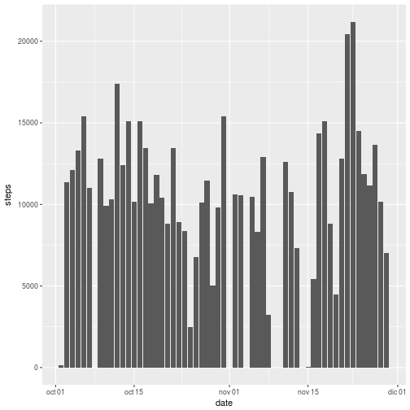
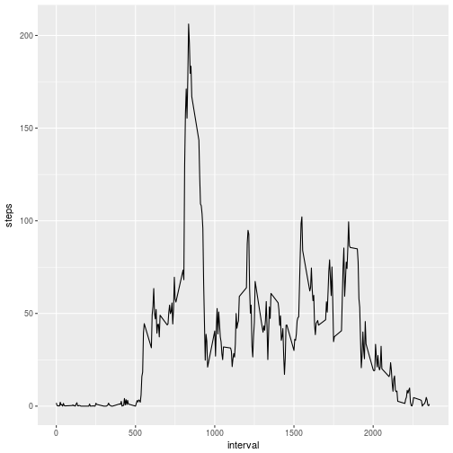
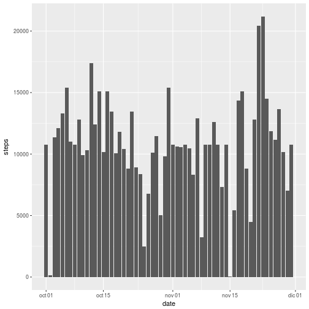

## Loading and preprocessing the data
Before loading the data, I unzip the zipped file. Then I read it using read.csv() and assign it to a variable called *df*


```r
library(ggplot2)
library(lubridate)
library(xtable)
data.file="activity.csv"
zip.file="activity.zip"
unzip(zip.file)
df <- read.csv(file=data.file)
```

The only data transformation needed is to convert the date from a plain string into Date objects:

```r
df$date <- as.Date(df$date, "%Y-%m-%d")
```


## What is mean total number of steps taken per day?


For calculating the total number of steps taken per day, I group the data by days and then I sum each group, using the *aggregate* function:


```r
steps.per.day <- aggregate (steps ~ date, df, sum)
```

For drawing the histogram (and the other plots), I use the *ggplot2* library:


```r
ggplot(data=steps.per.day, aes(date)) + geom_histogram(stat="identity", aes(y=steps))
```



Meand and median:

```r
mean(steps.per.day$steps)
```

```
## [1] 10766.19
```

```r
median(steps.per.day$steps)
```

```
## [1] 10765
```


## What is the average daily activity pattern?

For plotting the average daily activity pattern, I make an aggregate sum of steps, grouped by interval, so the average is across all days


```r
steps.per.interval <- aggregate (steps ~ interval, df , mean)
```

Now  I can draw the time series plot:

```r
ggplot(steps.per.interval, aes(interval, steps)) +  geom_line()
```



For calculating the interval with the maximum number of steps, I use the max function over the *steps.per.interval$steps* variable just created: 


```r
max.value <- max(steps.per.interval$steps)
max.interval <- steps.per.interval[steps.per.interval$steps==max.value,]
print(xtable(max.interval), type="html")
```

<!-- html table generated in R 3.2.3 by xtable 1.8-2 package -->
<!-- Mon Mar 20 18:17:28 2017 -->
<table border=1>
<tr> <th>  </th> <th> interval </th> <th> steps </th>  </tr>
  <tr> <td align="right"> 104 </td> <td align="right"> 835 </td> <td align="right"> 206.17 </td> </tr>
   </table>


## Imputing missing values
Total number of missing values: 


```r
sum(is.na(df$steps))
```

```
## [1] 2304
```
For filling the missing values in the dataset, I assign the mean for that 5-minute interval. I use the *mapply* function to look for the proper value to each missing value, and assign the result to a data frame called *df2*


```r
df2 <- df

df2$steps <- mapply(
    function (df_steps, df_interval) {
      if (is.na(df_steps)) {steps.per.interval[steps.per.interval$interval==df_interval,]$steps}
      else df_steps
}, df2$steps, df2$interval)
```

With the missing data filled the histogram looks like this: 


```r
steps.per.day.nonulls <- aggregate (steps ~ date, df2, sum)

ggplot(data=steps.per.day.nonulls, aes(date)) + geom_histogram(stat="identity", aes(y=steps))
```



Meand and median:

```r
mean(steps.per.day.nonulls$steps)
```

```
## [1] 10766.19
```

```r
median(steps.per.day.nonulls$steps)
```

```
## [1] 10766.19
```

We can see that the mean is the same and the the median a bit larger

## Are there differences in activity patterns between weekdays and weekends?

I create a new attribute in the data frame, *isweekend*,  to identify if a day is weekend or not:


```r
df2$isweekend<-wday(df2$date)
df2$isweekend<-sapply(df2$isweekend, function(x) {if (x==7 | x==1) "weekend" else "weekday"})
df2$isweekend <- as.factor(df2$isweekend)
```

Finally, I draw a plot with two panels, one for weekdays and one for weekends


```r
steps.per.interval.nonulls <- aggregate (steps ~ interval * isweekend, df2, mean)
ggplot(steps.per.interval.nonulls, aes(interval, steps)) +  geom_line() + facet_grid(isweekend ~ .)
```


